# TradeX 🚀

TradeX is a full-stack stock trading platform inspired by Zerodha.  
The project provides user authentication, portfolio management, holdings tracking, and order management with a modern trading dashboard UI.

---

## ✨ Features

- 🔐 JWT Authentication
- 🍪 Secure Cookie-based Login System
- 📈 Trading Dashboard UI
- 📊 Holdings & Positions Management
- 🛒 Order Placement System
- ⚡ Fast Frontend using Vite
- 🌐 REST API using Express.js
- 🗄️ MongoDB Database Integration

---

## 🛠️ Tech Stack

### Frontend
- React.js
- Vite
- Axios
- React Router DOM
- React Toastify

### Backend
- Node.js
- Express.js
- MongoDB
- Mongoose
- JWT Authentication
- bcrypt.js
- cookie-parser
- CORS

---

## 📁 Folder Structure

```bash
TradeX/
│
├── backend/      # Express Backend & APIs
├── frontend/     # Authentication Frontend
├── dashboard/    # Trading Dashboard
```

---

## ⚙️ Environment Variables

Create a `.env` file inside the `backend` folder.

```env
PORT=8080
MONGO_URL=your_mongodb_connection_string
TOKEN_KEY=your_secret_key
```

---

## 🚀 Installation & Setup

### 1️⃣ Clone Repository

```bash
git clone https://github.com/your-username/TradeX.git
cd TradeX
```

---

## ▶️ Run Backend

```bash
cd backend
npm install
npm start
```

Backend runs on:

```bash
http://localhost:8080
```

---

## ▶️ Run Frontend

```bash
cd frontend
npm install
npm run dev
```

Frontend runs on:

```bash
http://localhost:5173
```

---

## ▶️ Run Dashboard

```bash
cd dashboard
npm install
npm run dev
```

Dashboard runs on:

```bash
http://localhost:5174
```

---

## 🔐 Authentication Flow

1. User signs up / logs in
2. Backend generates JWT token
3. Token stored in HTTP-only cookies
4. Protected dashboard verifies user session
5. Logout clears authentication cookies

---

## 📸 Screenshots

### 🔐 Authentication Pages

| Login Page | Signup Page |
|------------|-------------|
| 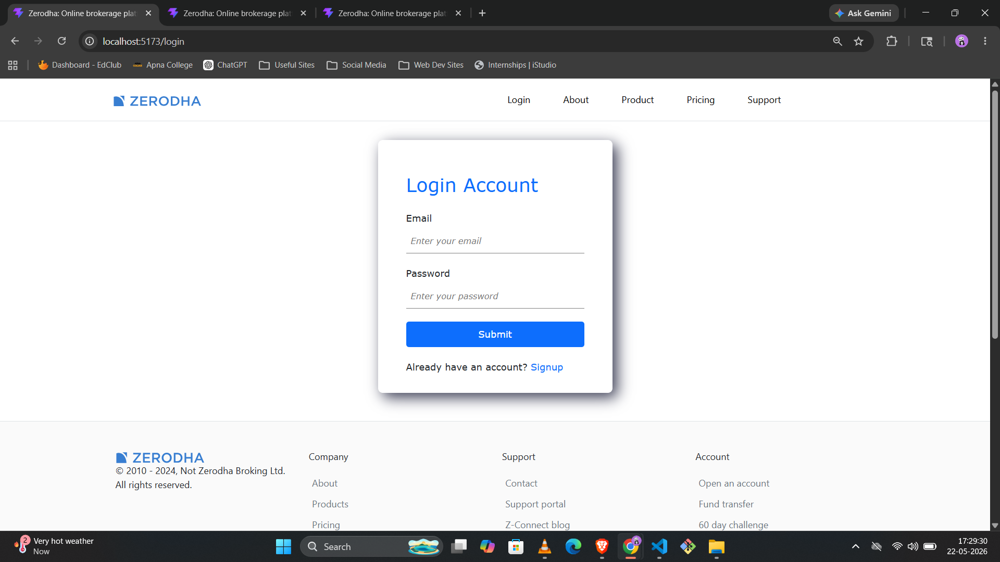 | 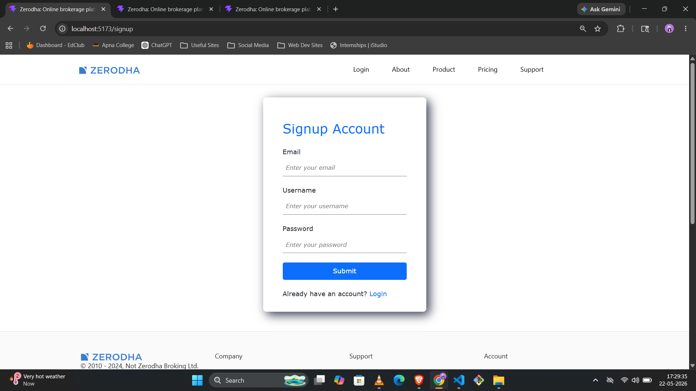 |

---

### 🌐 Frontend Website

| Home | About |
|------|--------|
| 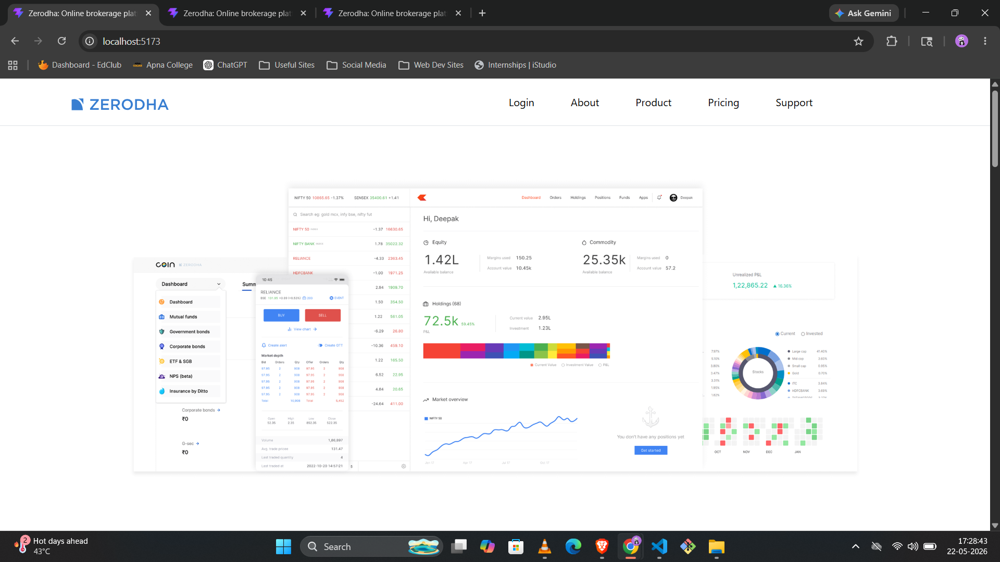 | 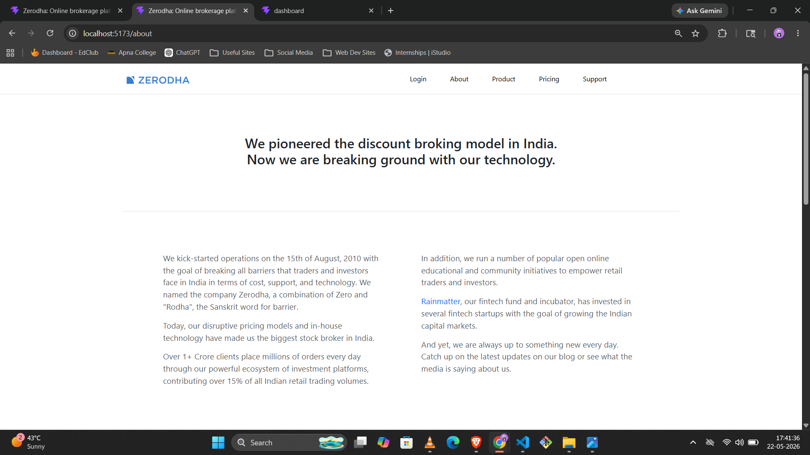 |

| Product | Pricing |
|----------|----------|
| 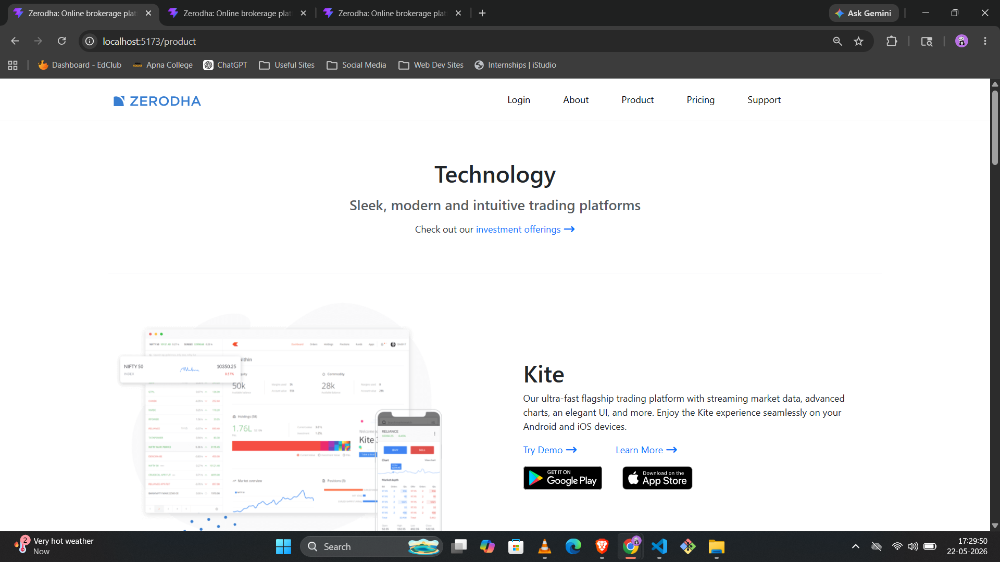 | 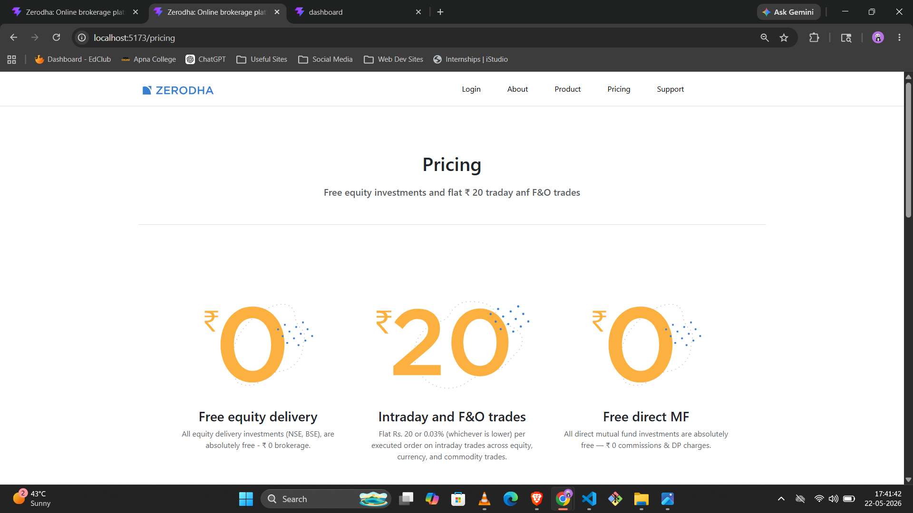 |

| Support | Footer |
|----------|---------|
| 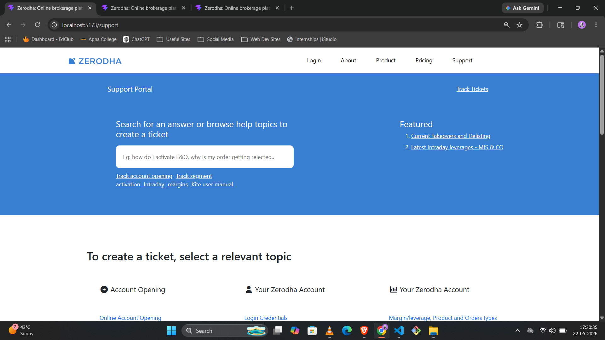 | 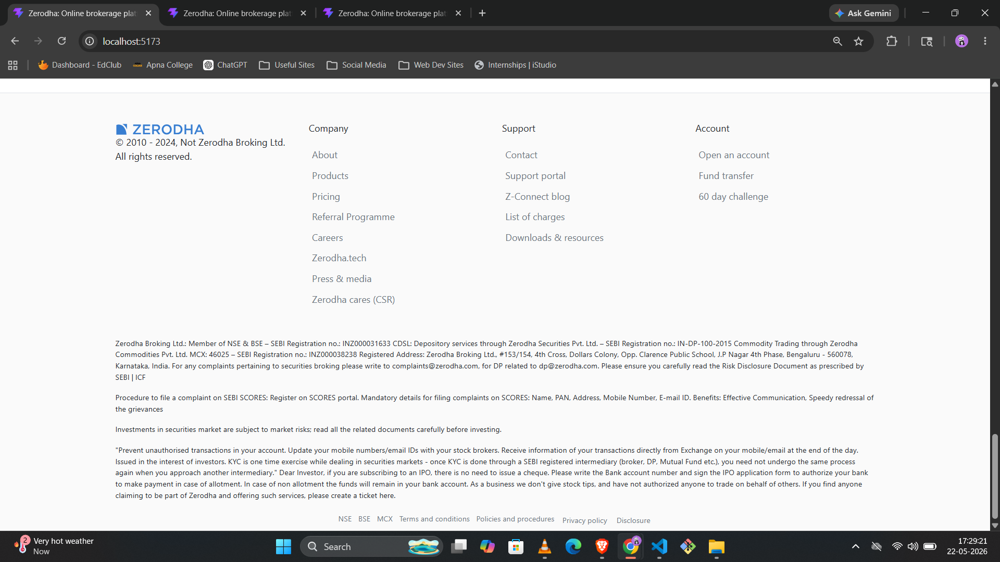 |

---

### 📊 Dashboard

| Dashboard | Holdings |
|------------|-----------|
| 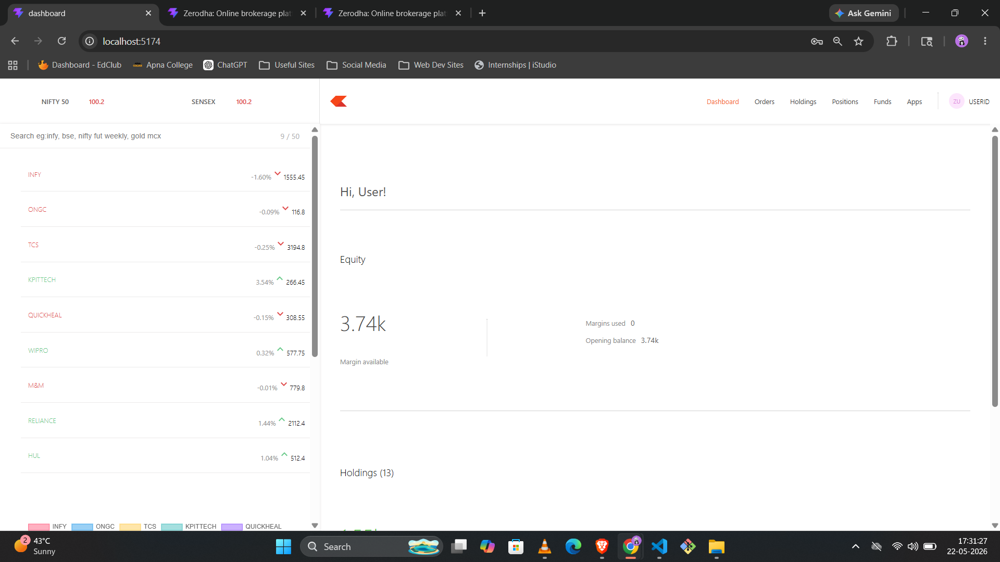 | 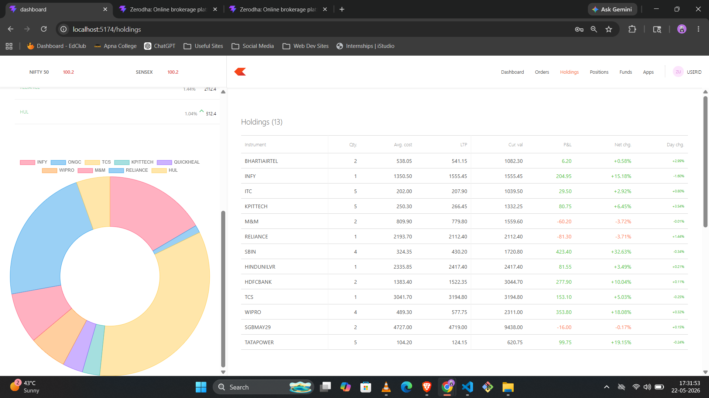 |

| Holdings Analytics | Funds |
|--------------------|-------|
| 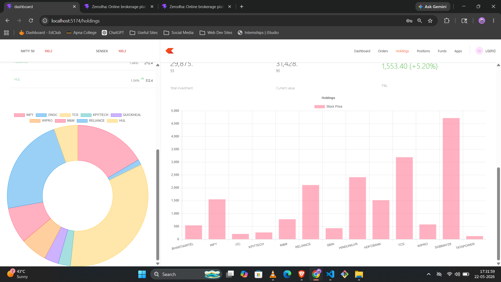 | 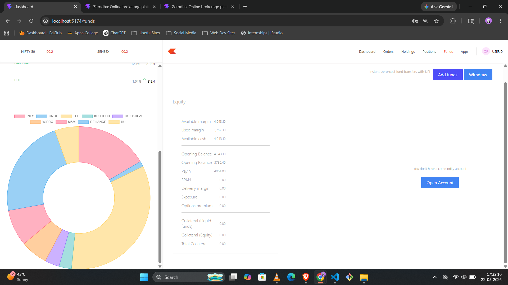 |

| Positions |
|------------|
| 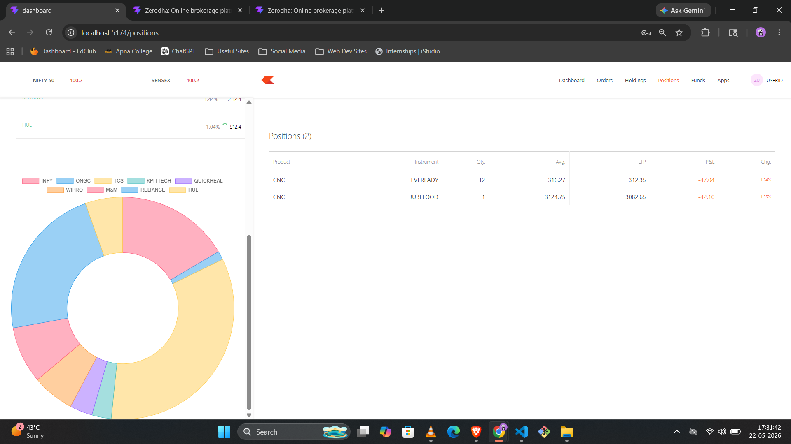 |

---

### 🗄️ Database Collections

| Holdings | Positions | Users |
|-----------|------------|-------|
| 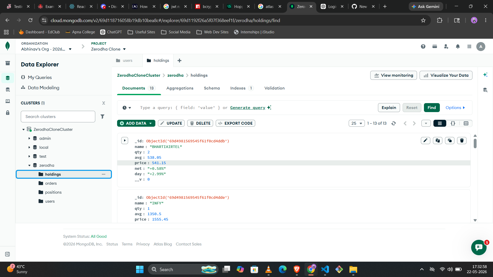 | 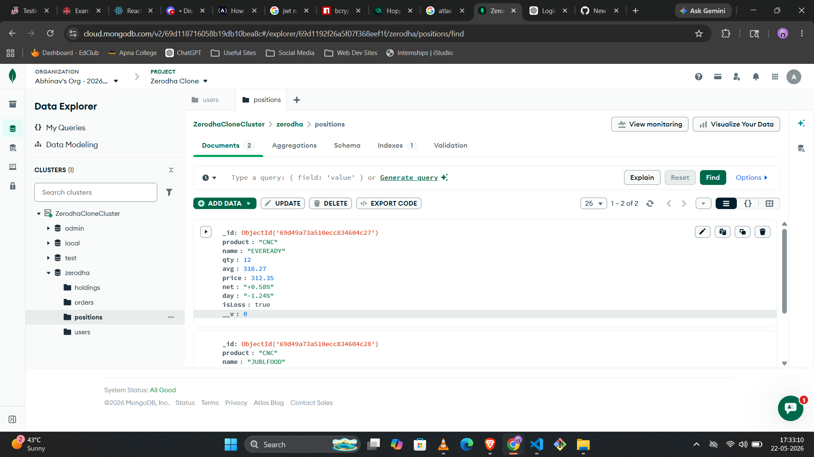 | 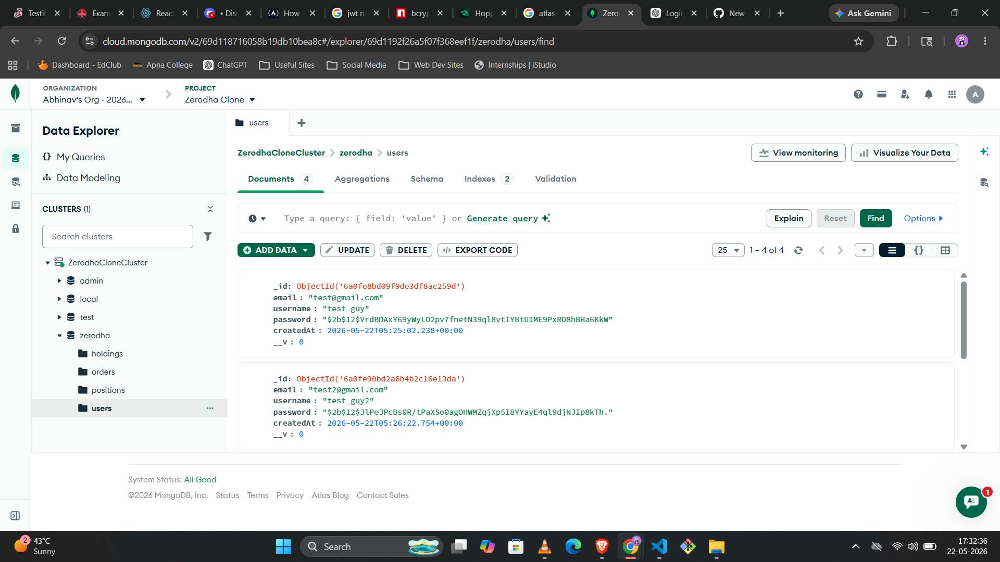 |

---

---

## 📌 Future Improvements

- 📉 Real-time Stock Market Data
- 📊 Interactive Charts
- 💳 Payment Gateway Integration
- 📱 Responsive Mobile Design
- 🔔 Live Notifications

---

## 👨‍💻 Author

Developed by Abhinav

---
